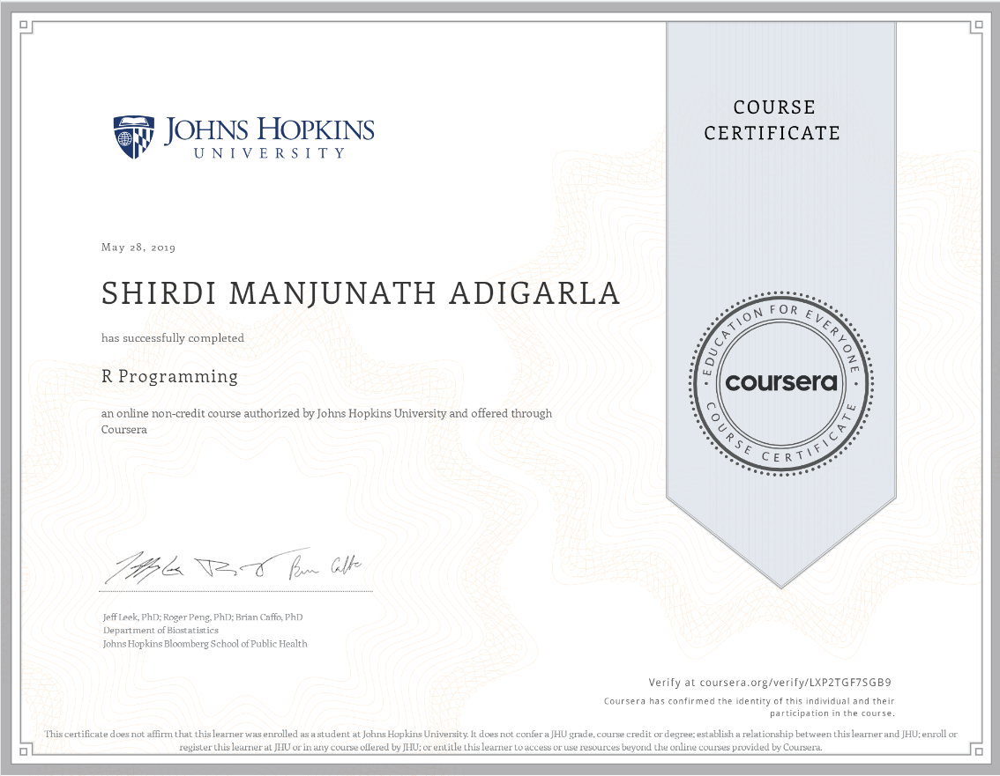

# Tutorial

* [swirl](https://swirlstats.com/) software package used
1. https://swirlstats.com/

# datasets used

#### default R dataset
+ iris
+ mtcars

#### csv dataset
- Air pollution: sulphur and nitride
- Hospital dataset
